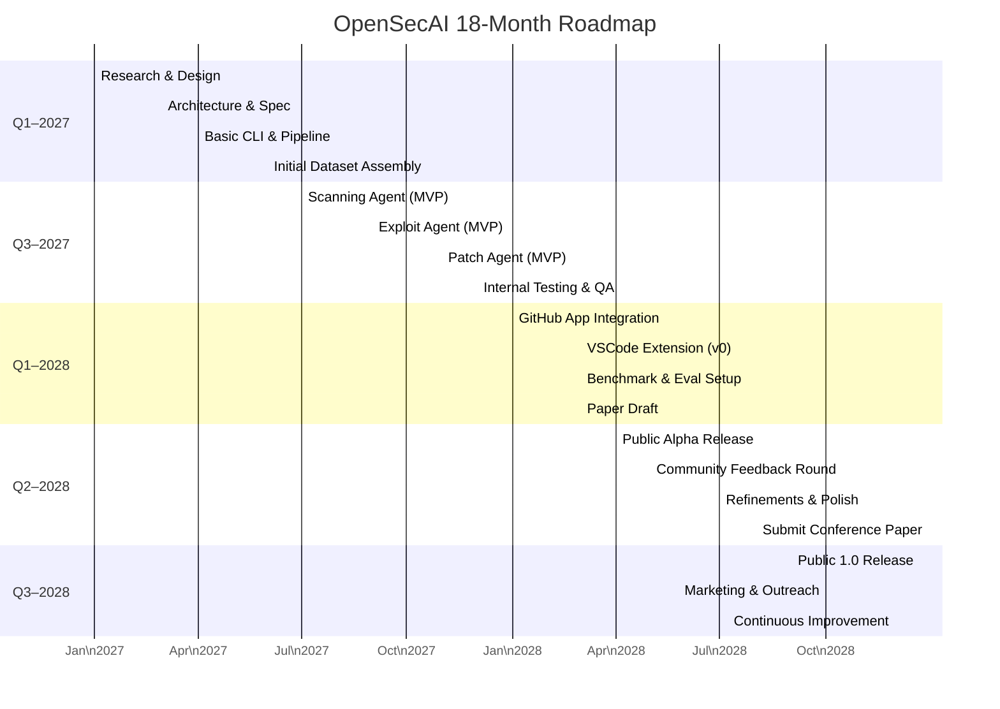

# Executive Summary  
AI-generated code often contains critical vulnerabilities. Studies report ~30–40% of Copilot/LLM code has security flaws. Existing tools (Semgrep, CodeQL, Snyk, Copilot Code Review, etc.) lack full context, exploitation checks, or automatic fixes. We propose **OpenSecAI**: an open-source, multi-agent “AI Security Engineer” that continuously scans code (static & LLM analysis), attempts to exploit findings in a sandbox, and generates verified patches and PRs.  

- **Novelty:** Combines static analyzers and LLM reasoning in a loop with exploitation-based verification. This reduces false positives and ensures real bugs are fixed.  
- **Impact:** Publishable research on “AI-verified automated repair” (e.g. verifying LLM findings with proof-of-concept exploits) and an end-to-end tool developers can use.  
- **Highlights:** Multi-agent design (Scanning, Red-team, Patching agents); uses SARIF for integration; provides GitHub App and CLI; benchmarks vs static/L LLM baselines; hardware-isolated sandbox for safety.  

# Project Scope & MVP Features  
- **Goal:** Build an autonomous AppSec teammate. Key capabilities:  
  - *Vulnerability Detection:* Static analysis (e.g. CodeQL, Semgrep) plus LLM reasoning to find logic flaws.  
  - *Exploit Verification:* For each finding, automatically generate and run a PoC exploit in a safe sandbox to confirm exploitability.  
  - *Automated Repair:* Use LLMs to suggest code fixes and generate security unit tests. Verify that patched code passes tests and no longer triggers the scanner.  
  - *Feedback Loop:* Learn from results (which fixes were accepted or rejected) to improve future analyses.  

- **Prioritized MVP features (1–3 months):**  
  - **Core Agent Pipeline:** Scanning agent (runs static tools + LLM analysis), exploit agent (tries simple PoC), patch agent (LLM fix + test).  
  - **CLI Tool:** Command-line interface to point at a repo/directory and run the full pipeline. Output findings/patches in SARIF and console.  
  - **GitHub Integration:** GitHub App or Actions to run on push/PR. Auto-create issues or PRs with proposed fixes.  
  - **Basic Language Support:** Start with one popular language (e.g. Python or JavaScript) and common CWEs (SQLi, XSS, RCE, etc.). Use CodeQL/Semgrep rulesets for those.  

- **Secondary features (3–6 months):**  
  - **Multi-language support:** Add more languages (Go, Java) and tools (Bandit for Python, SpotBugs for Java).  
  - **Editor Extension:** VS Code extension that uses local OpenSecAI to analyze code in-editor.  
  - **Benchmark & Dataset:** Assemble a test suite of vulnerable code (see Dataset section).  

# Detailed Architecture  

```mermaid
flowchart LR
  A[Developer Repo/PR] --> B{OpenSecAI Agents}
  B --> C[Scanning Agent] 
  C --> D[Static SAST Tools] 
  C --> E[LLM Analysis (Chain-of-Thought)] 
  D --> F[Candidate Vulnerabilities]
  E --> F
  F --> G[Exploit Agent]
  G --> H[Sandbox Execution]
  H --> I{Confirmed?}
  I -->|Yes| J[Patching Agent]
  I -->|No| K[False Positive Logged]
  J --> L[Generate Fix + Tests]
  L --> M[Retest with Scanners]
  M --> N{Secure?}
  N -->|Yes| O[Open GitHub PR (SARIF report)]
  N -->|No| P[Iterate or flag for review]
  Q[CI/CD: GitHub App/Action] --> B
```
**Figure:** Multi-agent pipeline. The Scanning Agent runs static analyzers (CodeQL, Semgrep) and LLM prompts to list potential issues. The Exploit Agent generates PoC exploits and runs them in an isolated sandbox. Confirmed bugs are passed to the Patching Agent, which uses LLMs to suggest fixes and unit tests. A GitHub App orchestrates this on each push/PR.  

- **Components:**  
  - **Agents:** Separate modules (processes or microservices) for *Scan*, *Exploit*, and *Patch*. This mirrors CrowdStrike’s triad and AutoPatch’s multi-agent approach. They communicate via a coordinator or message queue.  
  - **LLMs:** Use large models (GPT-4o/GPT-5, Claude 3.5 Sonnet) via API for initial MVP, plus open-source models (Llama 3, CodeLlama, StarCoder2, Qwen) for cost-sensitive use. GPT-4o achieves ~90% on coding tasks, open models like Qwen72B ~87%.  
  - **Local vs Cloud:** Support local LLMs (for privacy/offline) and optional cloud APIs (OpenAI, Anthropic). Use client libraries or REST wrappers.  
  - **Sandboxing:** Each exploit runs in a container or microVM (e.g. Firecracker, gVisor) with strict policies. No host mounts or network egress. Monitor runtime and kill on timeout or success.  
  - **Data Flow:** Repository → build (if needed) → static scan + index (via Tree-sitter/LSIF) → vulnerability list. For each, the Exploit Agent spins up a sandbox, attempts exploit (e.g. curl or custom script), reports success/failure. The Patching Agent then calls LLM (with CodeQL feedback if available) to generate a patch and test code.  
  - **Architecture Diagram:** The flowchart above (Mermaid) summarizes the control flow; see also CrowdStrike’s figure of their 3-agent loop.  

# Technical Stack Recommendations  

- **Languages:** Python (backend, LLM orchestration, SAST invocation). Node.js/TypeScript (optional web UI or VSCode extension). Python is common in security tools (DeepAudit uses FastAPI/Python).  
- **LLM Framework:** LangChain or custom tool-chaining. Use vector DB (SQLite/FAISS) for retrieval if needed (like AutoPatch’s use of Postgres vector store).  
- **Static Analysis:** CodeQL (GitHub) via CLI (its results can be exported to SARIF). Semgrep (fast patterns). Bandit (Python), SpotBugs (Java), npm audit (JS), Trivy (containers). Integrate results in SARIF format.  
- **Exploit Sandbox:** Docker with Seccomp/AppArmor (e.g. no-new-privileges, read-only root) as a baseline. For higher safety, use microVMs (e.g. Firecracker, gVisor) which have hardware isolation.  
- **Databases:**  
  - **Vector DB:** SQLite or Postgres+PGVector for CVE retrieval (like AutoPatch).  
  - **Git Storage:** Git repositories via PyGithub or Git CLI.  
- **CI/CD Integration:** GitHub Actions for initial builds; GitHub App (Python service or Probot) for PR management. Tools: PyGithub, Octokit. Ensure SARIF reports can be uploaded (GitHub supports SARIF).  
- **Testing:** Pytest/Unittest for code, and a suite of intentionally vulnerable projects. Use coverage metrics for test generation.  
- **Output:** Use SARIF v2.1 (industry standard) for vulnerability results. Patch outputs via git diff in PRs.  
- **Data Formats:** SARIF for findings; JSON for internal exchange; optionally LSIF for code indexing.  
- **Model Hosting:** For LLM inference, use cloud APIs or host open models via Hugging Face/PyTorch on GPU nodes. Possibly support local quantized models (e.g. Llama3-8B) to lower cost.

# Dataset & Benchmark Plan  
- **Sources:**  
  - **Real Vulnerabilities:** CVE database (NVD) and GitHub advisories. Use CVEfixes projects to fetch vulnerable code and patches. AutoPatch uses 75 high-severity CVEs (525 code snippets) as a model.  
  - **Synthetic/Benchmarks:** NIST’s SARD and Juliet test suites (contains thousands of small programs with vulnerabilities). OpenWebAppSecBenchmark for web bugs. CWE lists for labeling.  
  - **Open-Source Projects:** Public repos known to have CVEs (e.g. based on GHSA tags). E.g. DeepAudit found 49 CVEs in 17 projects – these codebases can be used.  
- **Labeling:** Each example should record the CWE category, severity (CVSS), and a ground-truth patch. Use SARIF fields for CWE.  
- **Exploit Generation:** For evaluation, design exploit templates (SQL injection, XSS payloads, etc.) and known PoCs. Optionally use fuzzers (OWASP ZAP or AFL) guided by LLM to generate PoCs. The benchmark measures whether the Exploit Agent can reach the same results.  
- **Metrics:**  
  - *Detection:* Precision, recall, F1 for vulnerability identification (compare against ground truth).  
  - *Verification:* True positive rate of confirmed finds vs false positives eliminated. If `P` flagged issues and `V` truly exploitable, measure %exploits successful.  
  - *Patch Success:* Accuracy of patches (like AutoPatch’s 95%). Measure whether patched code passes unit tests and no longer has the vulnerability.  
  - *PR Quality:* % of automated fixes merged by developers (human eval).  
  - *Efficiency:* e.g. time saved vs manual triage (CrowdStrike reported ~90% time reduction).  
  - *Cost:* API calls, CPU hours, to evaluate feasibility (AutoPatch noted 50× lower cost than fine-tuning).  

# Research Contributions & Experiments  
- **Novelty:** The key research idea is “Verified Autonomous Security Repair”: requiring exploit validation before patching. While prior work focuses on detection or LLM patching alone, we will publish on how exploit validation reduces false positives and improves developer trust.  
- **Experiments:**  
  1. **Detection Baseline:** Compare our Scan agent vs static tools (CodeQL, Semgrep) on known vulnerable code. Metrics: F1, false positive rate. Hypothesis: LLM adds recall on logic flaws.  
  2. **Verification Impact:** Run tests with and without exploit verification. Show how many static/LLM finds are pruned (precision gain). Use statistical tests (e.g. McNemar’s test on matched pairs of findings).  
  3. **Patch Quality:** Compare our auto-patches vs baseline (e.g. LLM-only fix or human patch) on the benchmark. Measure correctness (test suite pass) and security (re-scan). Use Z-test on patch success rates.  
  4. **Agent Ablation:** Disable each agent (e.g. no exploit stage) to quantify their contribution.  
  5. **Multi-Model:** Test different LLMs (GPT-4o, Claude 3.5, Llama3) for core tasks. E.g. AutoPatch used GPT-4o to reach ~89.5% verification F1; measure if smaller models can approach that with more prompts.  
  6. **Performance:** Benchmark runtime for a codebase of X lines.  
- **Baselines:**  
  - Static tools alone (CodeQL, Semgrep).  
  - Existing AI code reviewers (e.g. VulnHuntr, LLMSecGuard).  
  - Human expert review (if feasible).  
- **Statistical Significance:** Use paired tests (bootstrap confidence intervals for F1 differences) and report p-values for improvements. Aim for significance at p<0.05.  
- **Publication:** Target venues like IEEE S&P, USENIX Security, or NeurIPS/ICLR AI×Security workshop. Emphasize the multi-agent architecture and benchmark results.  

# Security, Legal & Ethical Considerations  
- **Sandbox Safety:** Use hardware-backed isolation (microVMs or separate VMs). Apply default-deny policies (no host mounts, no internet). Rotate/scrub sandbox between runs to prevent persistence. Monitor for escape (CVE-2026-22709 warns VM escapes exist).  
- **Responsible Disclosure:** If OpenSecAI discovers new vulnerabilities in open source or deployed code, follow coordinated disclosure (e.g. ISO 29147) and avoid publishing exploits publicly until patches exist. Possibly integrate with security.txt/CVE processes.  
- **Licensing:** Choose a permissive license (MIT or Apache 2.0) to encourage adoption. Avoid GPL/AGPL if broad use is desired. (DeepAudit uses AGPL, which forces open-sourcing derivative work—our choice depends on community goals).  
- **Dependency Licenses:** Ensure all integrated tools (e.g. Semgrep, CodeQL) are license-compatible.  
- **Data Privacy:** For self-hosted mode, keep code entirely local. For API mode, warn users that code may be sent to third parties (OpenAI, etc.) – include a clear privacy statement.  
- **Export Controls:** Be aware of cryptography export rules (if including crypto fixes) and AI tech (some LLMs are US-controlled). Use MITM disclaimers if needed.  
- **Ethics:** Avoid using the tool for scanning proprietary code without consent. Provide terms of use stating it’s for authorized security testing only.  

# Open-Source Strategy  
- **Repository:** Monorepo on GitHub with modular structure:  
  - `scanning/`, `exploit/`, `patch/` modules, plus `app/` for CLI and web.  
  - `docs/`, `benchmarks/` dataset, `examples/` vulnerable projects.  
  - Use standard layouts (Python package, Node for UI).  
- **License:** MIT or Apache 2.0 (permissive, widely used). SARIF itself is OASIS standard.  
- **Contributing:** Clear README, CONTRIBUTING.md, Code of Conduct. Use continuous integration (GitHub Actions) for tests.  
- **Governance:** Start with a core team. Use Issues/PRs for transparency. Possibly form a technical steering committee if the project grows.  
- **Community Growth:** Announce on Hacker News, Reddit r/netsec, and at conferences. Encourage collaboration with AppSec and AI researchers.  
- **GitHub App/VSCode Roadmap:** Develop a GitHub App that can be installed on repos, with secure OAuth. Also plan a VSCode extension (TypeScript) that calls the CLI or API for on-the-fly analysis.  
- **Marketing:** Publish blog posts or talks comparing OpenSecAI to existing tools. Offer demos at security meetups. Leverage contributors’ networks.  

# Timeline & Milestones  



- **Key Milestones:**  
  - M1 (Mar 2027): Architecture defined; basic CLI working.  
  - M2 (Sep 2027): MVP pipeline complete (scan → exploit → patch).  
  - M3 (Dec 2027): Internal alpha tested on sample projects.  
  - M4 (Mar 2028): GitHub App/VSCode ready; draft paper; initial benchmark results.  
  - M5 (Sep 2028): Public 1.0 release; research submission.  

- **Resources:** ~2–3 developers (15–20 PM each) + 1 part-time researcher. Compute: GPU server(s) for LLM, Docker/VM hosts (could use cloud EKS/VM clusters). Estimated budget: $10–20K/year for cloud GPU if on-demand, or $3K one-time for a local 4xA100 machine.  

# Candidate Models, Sandboxing & Tool Comparison  

| Model            | Type         | Code Task (HumanEval) | License       | Notes                     |
|------------------|--------------|-----------------------|---------------|---------------------------|
| GPT-4o (GPT-4.5) | Closed API   | ~90%       | Commercial    | Top performance, high cost per call. |
| Claude 3.5 Sonnet| Closed API   | ~92%       | Commercial    | Best-in-class for reasoning. |
| Llama 3.3 70B    | Open-source  | ~80–82%    | Apache-2.0    | Good balance of performance/cost. |
| Qwen 2.5 72B     | Open-source  | ~86%       | MIT           | Near GPT-4 quality on code. |
| StarCoder2 34B   | Open-source  | ~78% (est.)           | Apache-2.0    | Large open model fine-tuned for code. |
| CodeLlama 34B    | Open-source  | ~80% (est.)           | Apache-2.0    | Meta’s code model, strong in code tasks. |
| Phi-2 7B/33B     | Open-source  | 57% (7B), 88% (33B)  | Apache-2.0    | Fast (Phi-4) and decent (Phi-7). |

| Sandbox Method       | Example  | Strengths                                    | Limitations                                   |
|----------------------|----------|----------------------------------------------|-----------------------------------------------|
| **MicroVM** (Firecracker) | AWS Nitro, Firecracker | Hardware isolation, minimal host surface | More complex setup, requires virtualization support. |
| **Container (Docker)** | Docker with seccomp | Easy to use; many tools (e.g. Kata Containers) | Shares kernel; escape risks remain. Needs strict seccomp/AppArmor. |
| **Dedicated VM**     | QEMU/KVM | Strong isolation, mature security (SELinux)  | Heavyweight, slower spin-up. |
| **Language Sandbox** | WASM, PyPy | Limits to memory/safe subset                  | Limited capability; less common for general code. |

| Tool/Project       | Category         | Key Feature                             | Gap/Notes                                      |
|--------------------|------------------|-----------------------------------------|------------------------------------------------|
| **CodeQL (GitHub)**| SAST (static)    | High-accuracy static queries (CVE DB)    | No generative fixes; closed source by MS.      |
| **Semgrep**        | SAST/Rules       | Fast patterns, many community rulesets   | Cannot reason beyond pattern matching.         |
| **Bandit**         | SAST (Python)    | Python-specific vulnerability scanner    | Limited to Python; no LLM integration.         |
| **PullGuard (SSA)**| AI Code Review   | AI-powered scanning for PRs             | Commercial; no exploit verification.          |
| **GitHub Copilot Review** | AI Review | Auto code suggestions & comments        | Misses deep flaws; not open source.            |
| **LLMSecGuard** | LLM+Static    | Benchmarks LLM security; open-source | Research prototype; Python only.           |
| **VulnHuntr**    | LLM Auditor     | Chain-of-Thought LLM scanning + PoC | Python only; analysis focus, no auto-fix.      |
| **DeepAudit**    | Multi-agent Audit| Discovered 49 CVEs in 17 projects | Chinese project; heavy UI; AGPL license.     |
| **AutoPatch**      | LLM Patcher     | RAG-driven CVE matching, 95% patch acc | Closed prototype; IDE plugin.               |
| **ShellCheck**     | SAST (Shell)     | Shell script analysis                    | Limited scope; no LLM.                         |
| **Trivy**          | Vulnerability Scanner | Container/OS scanning                 | Not focused on custom code.                    |

# Experiments & Evaluation Protocols  
- **Benchmark Dataset:** Collect ~100 vulnerable projects (from SARD, CVEs, real repos). Split into train/dev/test. Include code and known fixes.  
- **Detection Evaluation:** Run OpenSecAI Scan vs CodeQL vs VulnHuntr on test code. Record True/False Positives. Compute Precision, Recall, F1. Use paired bootstrap to test F1 improvement (p<0.05).  
- **Exploit Verification:** Of all flagged issues, what fraction are exploit-verified? Compare to static-only (100% flagged). Report False Positive Rate reduction. (Use McNemar’s test on exploit success vs flag presence.)  
- **Patch Evaluation:** For confirmed vulns, let OpenSecAI produce a patch. Check (a) does original test suite pass? (b) re-run scanner. Baselines: GPT-4 prompt-only repair, and static-fix scripts (if any). Measure patch success and introduce regressions.  
- **Ablation & Models:** Turn off exploit step to show extra false positives. Test different LLMs (GPT-4o, Claude 3.5, Llama3) for key tasks; measure accuracy drop.  
- **Human Study (optional):** Security engineers rate patch quality or trust in tool, compared to manual fix.  
- **Statistical Tests:** Report confidence intervals. For binary (vuln detected or not), use McNemar; for patch success rate, use Chi-square or Fisher’s test.  

# Security, Legal, Ethical Considerations  
- **Sandbox Hardening:** Use techniques from OWASP AIVSS / Agent sandbox guidance. Apply “deny-by-default” on FS/network. Rotate ephemeral environments to prevent persistence (Augment Code guidelines).  
- **Exploit Dangers:** Never run tooling on unconsented third-party code. Only on code you own or with permission.  
- **Disclosure:** Follow responsible disclosure standards (ISO/IEC 29147) for new findings. Possibly integrate with MITRE CVE assignment if new zero-days are found.  
- **Licensing:** Clear open source license. Use SPDX headers. Respect “Four-clause BSD”-style licensing of some CVEs (include references).  
- **Privacy:** Allow users to disable cloud APIs; give warnings about sending code to LLM providers.  
- **Bias & Safety:** LLMs can hallucinate. Always require exploit evidence before acting. Do not rely solely on LLM claims.  

# Open-Source Strategy  
- **License:** MIT or Apache 2.0. These permit broad use and contributions. (Avoid copyleft unless needed.)  
- **Repo Structure:** Modular (see above). Maintain docs and examples. CI pipelines (GitHub Actions) to run security tests and SARIF validators on each commit.  
- **Contribution Guidelines:** Write clear docs (Tutorial, API reference). Label issues (“good first issue”). Establish Code of Conduct (e.g. Contributor Covenant).  
- **Governance:** Form a steering team (initially project leads). Use transparent decision-making on GitHub.  
- **Community:** Create discussion board (GitHub Discussions). Regularly publish release notes. Possibly form an advisory board of industry experts.  
- **Outreach:** Engage on security lists, AI forums. Offer webinars. Consider joining “GitHub Stars” program for projects.  
- **Integrations:** Provide easy install (pip/npm). Publish GitHub Action. Develop a VSCode extension (plugin = electron app calling our CLI).  

# Success Metrics  
- **Technical:**  
  - Detection F1 / patch accuracy benchmarks (target >90%).  
  - Case studies: Number of real vulnerabilities found in pilot audits.  
- **Community:**  
  - GitHub stars, forks, contributors count (e.g. ≥1k stars in first year).  
  - Downloads/adoptions (pip installs, GitHub app installs).  
  - Publications: acceptance at security/AI conferences, citations.  
- **Impact:**  
  - Pull requests merged from OpenSecAI.  
  - Surveyed developer satisfaction (if done).  
  - Measurable reduction in time-to-fix (CrowdStrike saw ~90% faster fixes).  

# Risks & Mitigations  
- **LLM Mistakes:** LLM hallucinations could suggest incorrect fixes. *Mitigation:* Always validate with static analysis and tests; use ensemble of models; require human review for critical fixes.  
- **Sandbox Escape:** Advanced models might find escapes. *Mitigation:* Harden sandbox (see above). Monitor agent logs for anomalies.  
- **Competitors:** Large vendors (OpenAI, Anthropic) may launch similar tools. *Mitigation:* Emphasize open-source, plugin architecture, and research transparency to differentiate.  
- **Adoption Barrier:** Security teams may distrust auto-fixes. *Mitigation:* Provide explainability (detailed SARIF findings and rationales) and tune to minimize false positives.  
- **Resource Cost:** LLM API usage can be expensive at scale. *Mitigation:* Use open models where possible; let users configure models.  
- **Legal:** Scanning customer repos might violate policies. *Mitigation:* Clear terms of service and opt-in mechanisms.  

