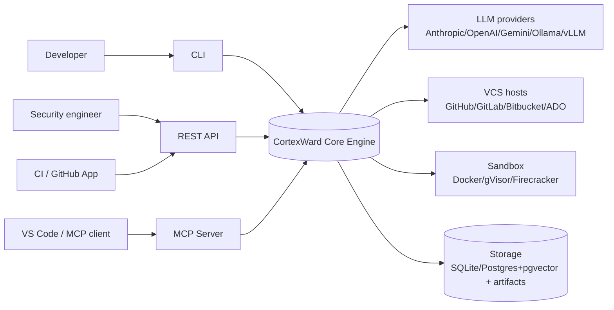
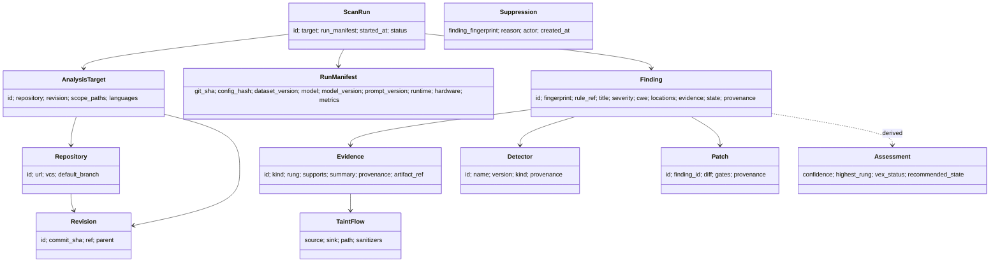
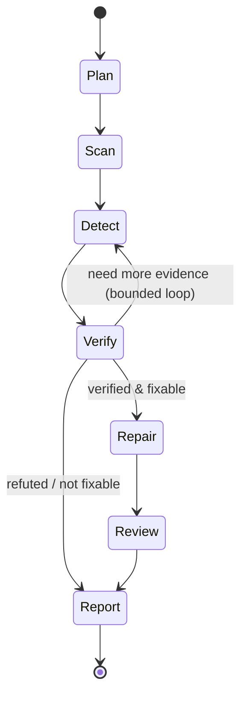
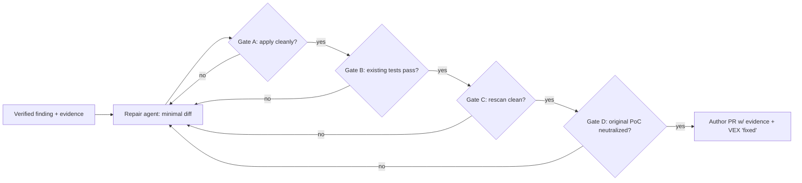

# CortexWard — Master Project Specification (MPS)

| | |
|---|---|
| **Version** | 1.0 |
| **Status** | Proposed (RFC — awaiting approval) |
| **Date** | 2026-07-05 |
| **Supersedes** | `deep-research-report.md` (research brief), ad-hoc `ARCHITECTURE.md` |
| **Amendment policy** | Once approved, this document is **frozen**. Changes are made only through numbered [ADRs](../adr/) that amend a specific section and bump the MPS patch/minor version. |
| **Companion docs** | [Phase-1 Review](../reviews/2026-07-05-phase-1-architecture-review.md) · [Evaluation Framework](../benchmark/evaluation-framework.md) · [ADR index](../adr/README.md) |

> This is the single source of truth for CortexWard. It is written as an RFC: normative
> requirements use **MUST / SHOULD / MAY** ([RFC 2119](https://www.rfc-editor.org/rfc/rfc2119)).
> Where a subsystem is not yet implemented, this document defines its *contract* so that
> implementation cannot drift from the design.

---

## Table of contents

1. [Vision](#1-vision)
2. [Mission](#2-mission)
3. [Core principles](#3-core-principles)
4. [Scope & non-goals](#4-scope--non-goals)
5. [Personas & use cases](#5-personas--use-cases)
6. [Functional requirements](#6-functional-requirements)
7. [Non-functional requirements](#7-non-functional-requirements)
8. [System architecture](#8-system-architecture)
9. [Component architecture](#9-component-architecture)
10. [Domain model](#10-domain-model)
11. [Verification Ladder specification](#11-verification-ladder-specification)
12. [Code Property Graph specification](#12-code-property-graph-specification)
13. [Agent architecture](#13-agent-architecture)
14. [LLM abstraction & model routing](#14-llm-abstraction--model-routing)
15. [Prompt & memory architecture](#15-prompt--memory-architecture)
16. [Patch generation pipeline](#16-patch-generation-pipeline)
17. [Plugin system & port catalog](#17-plugin-system--port-catalog)
18. [Event flow & data flow](#18-event-flow--data-flow)
19. [Database design](#19-database-design)
20. [API contracts](#20-api-contracts)
21. [Integrations](#21-integrations)
22. [Security architecture](#22-security-architecture)
23. [Benchmark & evaluation](#23-benchmark--evaluation)
24. [Performance & scalability](#24-performance--scalability)
25. [Repository structure](#25-repository-structure)
26. [Engineering standards](#26-engineering-standards)
27. [Release & versioning](#27-release--versioning)
28. [Governance & contribution](#28-governance--contribution)
29. [Roadmap](#29-roadmap)
30. [Open questions](#30-open-questions)
31. [Glossary](#31-glossary)

---

## 1. Vision

Within 3–5 years, CortexWard is the **default open-source autonomous security engineer**: the
system teams reach for to understand, verify, fix, and continuously secure software — the way
they reach for a compiler or a test runner. It is trusted because it never asserts what it
cannot substantiate, and adopted because it is open, extensible, and measurably effective.

## 2. Mission

Give every developer an autonomous AppSec teammate that:

1. **Understands** a codebase structurally (not just textually).
2. **Detects** vulnerabilities using static analysis, data-flow, and LLM reasoning.
3. **Verifies** each finding with the strongest feasible evidence (the Verification Ladder).
4. **Fixes** confirmed issues with minimal, validated patches.
5. **Communicates** results in standards-aligned form (SARIF, VEX, SBOM) with full provenance.
6. **Improves measurably** — every capability is tied to a benchmark metric.

## 3. Core principles

1. **Evidence over assertion.** No conclusion without attributable evidence. (Encoded in code.)
2. **An LLM is never sufficient on its own.** Models advise; concrete analysis decides.
3. **Untrusted by default.** Analyzed code, prompts, and repos are adversarial input.
4. **Reproducible.** Identical inputs → identical outputs; every result carries provenance.
5. **Pluggable everywhere.** Languages, scanners, LLMs, sandboxes, and VCS are adapters.
6. **Measured.** Features must move a benchmark metric; the benchmark exists *first*.
7. **Secure by construction, self-hostable by default.** Local, offline operation is first-class.
8. **Boring where it counts.** Standard formats, clean boundaries, small honest functions.

## 4. Scope & non-goals

### In scope
- Source-code SAST + data-flow + LLM-assisted detection for the [supported languages](#71-language-support).
- Evidence-based verification incl. sandboxed dynamic PoCs.
- Automated, validated patch generation and PR authoring.
- SARIF / VEX / CycloneDX outputs; SBOM and dependency/secret scanning.
- Delivery via CLI, REST API, Python SDK, GitHub Action/App, VS Code extension, MCP server.
- A reproducible benchmark & evaluation framework.

### Non-goals (v1.x)
- **DAST of running production systems** beyond the controlled sandbox PoC step.
- **Binary-only / closed-source analysis**, decompilation, malware analysis.
- **Autonomous merging** of patches (CortexWard proposes; humans merge).
- **A hosted SaaS** (the architecture must *permit* one; the project does not *operate* one in v1).
- **Replacing** CodeQL/Semgrep — CortexWard *orchestrates and verifies*, and integrates them.
- **Model training / fine-tuning** as a core dependency (memory is retrieval, not weights).

## 5. Personas & use cases

| Persona | Primary use | Surface |
|---|---|---|
| Individual developer | "Is my (AI-generated) code safe? Fix it." | CLI, VS Code, MCP |
| Security engineer | Triage, verify, and de-noise scanner output; VEX for a release | REST, CLI, SARIF/VEX |
| Platform/DevSecOps | Gate PRs; SBOM+VEX per build; org policy | GitHub Action/App, GitLab/ADO |
| OSS maintainer | Continuous scanning + fix PRs on a repo | GitHub App |
| Researcher | Reproducible experiments, ablations, new detectors | SDK, benchmark harness |

## 6. Functional requirements

Identifiers are stable (`FR-n`). "MUST" unless stated.

- **FR-1 Ingest** a target: local path, or a repo from GitHub/GitLab/Bitbucket/Azure DevOps at a
  specific revision. Record repository + revision provenance.
- **FR-2 Build a Code Property Graph** for supported languages without executing project builds.
- **FR-3 Run scanners** (Semgrep, Bandit, secret, dependency, …) and **normalize** results to the
  internal `Finding` model; **deduplicate/correlate** across tools via finding fingerprints.
- **FR-4 Detect** additional issues via CPG data-flow (taint) and LLM reasoning grounded in CPG
  retrieval.
- **FR-5 Verify** each finding by climbing the Verification Ladder to the strongest feasible rung;
  compute calibrated confidence, lifecycle state, and VEX status.
- **FR-6 Generate patches** for verified findings; validate against the three gates (tests pass,
  rescan clean, exploit neutralized). MUST NOT auto-merge.
- **FR-7 Report** as SARIF 2.1.0, CycloneDX-VEX/CSAF-VEX, and CycloneDX SBOM, plus human-readable
  console/Markdown; every artifact carries provenance and a `RunManifest` reference.
- **FR-8 Persist** runs, findings, evidence, patches, and manifests behind `StoragePort`.
- **FR-9 Record a `RunManifest`** for every run (git SHA, config, dataset version, model+version,
  prompt version, runtime, hardware, metrics) — sufficient to reproduce the run.
- **FR-10 Expose** the same core engine through CLI, REST, SDK, MCP, and CI integrations.
- **FR-11 Suppress/triage**: humans can dismiss/accept findings; decisions persist and feed memory.
- **FR-12 Benchmark**: run the evaluation harness over a versioned dataset and emit metrics.

### 6.1 Language support (FR-1 detail)

| Language | v1 target | Notes |
|---|---|---|
| Python | Reference (full ladder) | tree-sitter + Bandit + Semgrep + CPG taint |
| JavaScript / TypeScript | v1 | huge AI-generated surface |
| Java | v1.x | Semgrep + CPG |
| Go | v1.x | |
| Rust, C#, C/C++ | v2 | via `LanguageProvider` adapters, no core changes |

All language behavior is behind the [`LanguageProvider`](#171-port-catalog) port and validated by a
shared conformance suite. Adding a language MUST NOT require core changes.

## 7. Non-functional requirements

- **NFR-1 Reproducibility.** Structured LLM calls run at temperature 0; scan/graph results are
  content-addressed and cached; runs are replayable from the `RunManifest`.
- **NFR-2 Security.** See [§22](#22-security-architecture). All dynamic execution is sandboxed with
  deny-by-default egress. No self-approval capability is exposed to any model.
- **NFR-3 Privacy.** A fully **local/offline** mode MUST exist (local models, no egress). Any
  external model call requires explicit configuration and passes through secret redaction.
- **NFR-4 Performance/Scalability.** See [§24](#24-performance--scalability). Targets defined and
  benchmarked; horizontal scale-out is an adapter, not a rewrite.
- **NFR-5 Extensibility.** New scanners/languages/LLMs/sandboxes are installable packages
  discovered via entry points; zero core changes.
- **NFR-6 Observability.** OpenTelemetry traces every agent step, tool call, and model call;
  structured logs; per-run cost/token accounting.
- **NFR-7 Portability.** Linux, macOS, Windows for the CLI/SDK; containers for the server/sandbox.
- **NFR-8 Accessibility of results.** Deterministic exit codes; machine- and human-readable output.
- **NFR-9 Licensing.** Apache-2.0 core; all bundled tools license-compatible; SPDX headers.

## 8. System architecture

CortexWard is **hexagonal (ports & adapters)** with a pure domain core and an **in-process,
inspectable orchestrator**. Distribution/scale-out is a later *adapter*, not a founding
assumption.

### 8.1 Context (C4 level 1)



### 8.2 Container view (C4 level 2)

```
┌───────────────────────────────────────────────────────────────────────────┐
│ Delivery surfaces   CLI · REST API · Python SDK · MCP Server · GH Action/App │
│                     · VS Code extension            (all call the same core)   │
├───────────────────────────────────────────────────────────────────────────┤
│ Application (cortexward-orchestrator)                                        │
│   Orchestrator (state machine)  →  Planner · Scanner · Verifier · Repair ·   │
│   Reviewer · Coordinator · Memory     (agents operate on a typed RunState)   │
├───────────────────────────────────────────────────────────────────────────┤
│ Domain core (cortexward-core)   Finding · Evidence · Ladder · Patch ·        │
│   Repository · ScanRun · RunManifest · Detector · TaintFlow · Assessment     │
│   + PORTS (Protocols): CodeGraph · Scanner · LLM · Sandbox · VCS · Storage ·  │
│     Telemetry · LanguageProvider · Orchestrator                              │
├───────────────────────────────────────────────────────────────────────────┤
│ Adapters   tree-sitter CPG · Semgrep/Bandit/secret/dep scanners ·            │
│   Anthropic/OpenAI/Gemini/Ollama/vLLM/LiteLLM · Docker/gVisor · PyGithub/    │
│   GitLab/Bitbucket/ADO · SQLite/Postgres+pgvector · OpenTelemetry            │
└───────────────────────────────────────────────────────────────────────────┘
        dependency direction: surfaces → application → core ← adapters
```

**Rule (enforced in CI):** `cortexward-core` imports **nothing** from adapters, application, or
surfaces. Dependencies point inward. (See [§26](#26-engineering-standards), import-linter.)

## 9. Component architecture

| Component | Package | Responsibility |
|---|---|---|
| Domain core | `cortexward-core` | Model, ladder, ports, provenance. Pure. |
| CPG | `cortexward-cpg` | Parse → AST/CFG/DFG/call graph; query API. |
| Scanners | `cortexward-scanners` | Adapters + normalization + dedup. |
| LLM | `cortexward-llm` | Provider protocol, adapters, router, prompts. |
| Orchestrator | `cortexward-orchestrator` | Agents + state machine (LangGraph adapter). |
| Sandbox | `cortexward-sandbox` | Isolated execution for dynamic verification. |
| Storage | `cortexward-storage` | Event log + read models + artifact store. |
| Eval | `cortexward-eval` | Benchmark harness, metrics, datasets, RunManifest. |
| CLI / Server / SDK / MCP | `cortexward-cli` etc. | Delivery surfaces over the core engine. |

## 10. Domain model

The domain model extends the Phase 1 core. Entities are Pydantic value objects/aggregates; the
**persistence model is separate** (no ORM types in the domain).



### 10.1 Finding fingerprint (new, normative)

Every `Finding` MUST carry a deterministic `fingerprint` = a stable hash over
`(normalized_rule_id, file_path, structural_anchor, code_snippet_hash)`, where `structural_anchor`
is a CPG-node identity (function + statement kind + position within function) rather than a raw
line number, so the fingerprint survives reformatting and line shifts. Fingerprints enable
cross-tool **deduplication**, cross-run **tracking**, and **suppression** matching.

### 10.2 Calibration profile (new, normative)

The ladder's weights and thresholds MUST be encapsulated in a versioned `CalibrationProfile`
(default: the Phase 1 constants). The active profile id + version is recorded in the
`RunManifest`, so evaluations that tune calibration remain reproducible and comparable.

## 11. Verification Ladder specification

Normative definition of the project's central thesis. (Reference implementation exists in
`cortexward.domain.verification`.)

**Rungs** (monotone): `NONE(0) → STATIC_REACHABILITY(1) → TAINT_CONFIRMED(2) → DYNAMIC_POC(3) →
DIFFERENTIAL_TEST(4)`.

**Confidence** is combined in log-odds space: `logit = prior + Σ signed_weight(evidence)`,
`confidence = σ(logit)`. Supporting evidence contributes positive weight; refuting evidence
negative. Weights/thresholds come from the active `CalibrationProfile`.

**Invariants (MUST hold; property-tested):**
1. Adding supporting evidence never decreases confidence; adding refuting evidence never increases
   it (monotonicity).
2. Confidence ∈ [0, 1].
3. An LLM assessment alone cannot raise `highest_rung` above `NONE` and cannot yield `VERIFIED`.
4. `highest_rung` counts only non-LLM supporting evidence.
5. Terminal states (`PATCHED`, `DISMISSED`) are preserved by assessment.

**Per-CWE ceilings (new):** each CWE class declares the maximum rung it can reach (e.g. "missing
authorization" tops out at `TAINT_CONFIRMED`/differential test, not a network PoC). The profile
encodes ceilings so confidence is not unfairly penalized for classes that cannot admit a PoC.

**Outputs:** `Assessment{confidence, highest_rung, has_independent_corroboration, vex_status,
recommended_state, rationale}` → drives SARIF `level` and VEX `status`+`justification`.

## 12. Code Property Graph specification

The CPG is the technical moat: it powers reachability/taint (ladder rungs 1–2) **and** grounds LLM
reasoning in retrieved facts (the biggest lever on hallucination).

**Model.** A directed multigraph unifying:
- **AST** (tree-sitter parse) — syntactic structure.
- **CFG** — control-flow edges within functions.
- **DFG / def-use** — data-flow edges.
- **Call graph** — inter-procedural edges (best-effort for dynamic languages).
- **Dependency graph** — modules/packages from manifests (parsed, never executed).

**Node/edge schema (language-agnostic).** Nodes: `Module, Function, Parameter, Call, Assignment,
Literal, Identifier, Branch, Return, ...` with `{id, kind, language, location, properties}`. Edges:
`AST_CHILD, CFG_NEXT, DFG_REACHES, CALLS, IMPORTS, TAINTS`.

**Query API (port `CodeGraphPort`).** Cypher-like/graph queries plus purpose-built traversals:
`reachable(entrypoints, sink)`, `taint(source_catalog, sink_catalog, sanitizers)`,
`callers(fn)`, `slice(node)`. Backed by an in-memory graph (small repos) or a graph store
(Kùzu/Neo4j adapter) for large repos — behind the same port.

**Language specifics** (source/sink/sanitizer catalogs, entry-point detection, manifest parsing)
live in `LanguageProvider` adapters, not in the CPG core. A **conformance test suite** validates
each provider against fixture programs with known flows.

**Non-execution guarantee (security-critical):** building the CPG MUST NOT run project build
scripts, `setup.py`, package post-install hooks, or any target code. Parsing and manifest reading
only.

## 13. Agent architecture

Agents are stateless functions over a shared, typed `RunState`, coordinated by the Orchestrator.
The Orchestrator is defined by the `OrchestratorPort`; **LangGraph is one adapter** — its types
never appear in domain/application interfaces.



| Agent | Input → Output | Notes |
|---|---|---|
| **Planner** | target → plan (which languages, scanners, budget) | cost/time budgeting |
| **Scanner** | plan → raw findings | runs scanner adapters + CPG detectors |
| **Detector (LLM)** | CPG context → candidate findings/evidence | grounded retrieval; advisory only |
| **Verifier** | finding → evidence up the ladder | reachability, taint, sandbox PoC |
| **Repair** | verified finding → candidate patch | minimal diff |
| **Reviewer** | patch → gate verdicts | tests, rescan, exploit-neutralized |
| **Coordinator** | orchestrates, enforces budgets, dedup | owns RunState transitions |
| **Memory** | reads/writes triage + patterns | retrieval, not training |

**Safety:** no agent exposes a tool that lets a model mark a finding verified, dismiss it, or exit
the sandbox. State changes flow only through evidence-based assessment. Bounded loops (max
iterations, token/cost budget) prevent runaway agents.

## 14. LLM abstraction & model routing

**`LLMPort` (owned protocol, not a vendor SDK).** Capabilities: `complete`, `structured_output`
(JSON-schema/Pydantic), `tool_call`, `stream`, `count_tokens`, `cost_estimate`. Every call returns
usage (tokens, cost, latency) recorded to telemetry and the `RunManifest`.

**Adapters (v1):** native **Anthropic**, native **OpenAI**, **Gemini**, **Ollama**, **OpenAI-
compatible** (covers vLLM + most gateways), and **LiteLLM** as a catch-all backend. No provider
type leaks past the port.

**Model routing.** A declarative router maps *task class* → *model tier*:

| Task class | Default tier | Rationale |
|---|---|---|
| Triage / classification / dedup | small/cheap (e.g. Haiku-class, local) | high volume |
| Reasoning / detection / threat modeling | strong (e.g. Opus/Sonnet-class) | quality-critical |
| Patch generation | strong + verification gate | correctness-critical |
| Embeddings / retrieval | embedding model | pgvector |

Routing is config-driven and overridable per run; the chosen model+version is recorded per call.
**Local/offline mode** pins all tasks to local models. Providers are interchangeable — no
capability depends on a single vendor (NFR-3, principle 5).

## 15. Prompt & memory architecture

**Prompts** are versioned, hashed templates stored as files (`prompts/<name>/<version>.md`) with a
declared input schema and few-shot policy. The `prompt_version` is recorded in the `RunManifest`.
Untrusted code is always injected as clearly delimited **data**, never concatenated into the
instruction channel (prompt-injection defense, [§22](#22-security-architecture)).

**Memory** is retrieval-based and auditable, in three tiers:
1. **Run memory** — ephemeral `RunState`.
2. **Repository memory** — persisted triage decisions, suppressions, accepted-patch patterns,
   fingerprint history for a repo.
3. **Global knowledge** — CWE/CVE references, source/sink catalogs, curated exemplars.

Memory influences prompts via retrieval; it **never** updates model weights and never bypasses the
verification gate.

## 16. Patch generation pipeline



- **Minimal-diff constraint:** patches touch the smallest region that fixes the issue; no
  unrelated rewrites; style-preserving.
- **Three-gate validation (MUST):** existing tests pass, scanners re-run clean on the changed
  files, and the **original PoC no longer succeeds** against the patched code. Only then is a patch
  offered. `Patch.is_validated` gates PR authoring.
- **Never auto-merge.** PRs carry the finding, its evidence, the diff, and a VEX `fixed` statement.
- **Regression guard:** bounded retries; if gates cannot be satisfied within budget, flag for human
  review rather than shipping an unvalidated patch.

## 17. Plugin system & port catalog

**Discovery.** Plugins are Python packages registering under entry-point groups; the core resolves
them at runtime. No core change is required to add one.

| Entry-point group | Port | Example plugins |
|---|---|---|
| `cortexward.languages` | `LanguageProvider` | python, javascript, java, go |
| `cortexward.scanners` | `ScannerPort` | semgrep, bandit, gitleaks, osv |
| `cortexward.llm` | `LLMPort` | anthropic, openai, gemini, ollama, litellm |
| `cortexward.sandbox` | `SandboxPort` | docker, gvisor, firecracker |
| `cortexward.vcs` | `VCSPort` | github, gitlab, bitbucket, azuredevops |
| `cortexward.storage` | `StoragePort` | sqlite, postgres |
| `cortexward.reporters` | `ReporterPort` | sarif, vex, cyclonedx, markdown |

### 17.1 Port catalog (contracts, summarized)

Each is a `typing.Protocol` in `cortexward-core`. Full signatures land with the implementing phase.

- **`LanguageProvider`** — `parse(path) -> CPG`, `entrypoints(cpg)`, `sources()/sinks()/
  sanitizers()`, `dependencies(manifest)`. No build execution.
- **`ScannerPort`** — `scan(target) -> Iterable[RawFinding]`; adapter normalizes to `Finding`.
- **`CodeGraphPort`** — `reachable`, `taint`, `callers`, `slice`, `query`.
- **`LLMPort`** — see [§14](#14-llm-abstraction--model-routing).
- **`SandboxPort`** — `execute(spec) -> ExecResult` under an isolation policy; see
  [§22.4](#224-sandbox-execution-contract).
- **`VCSPort`** — `clone/checkout`, `open_pr`, `comment`, `read_pr_diff`.
- **`StoragePort`** — append events, materialize read models, put/get artifacts.
- **`TelemetryPort`** — spans, metrics, cost accounting.
- **`OrchestratorPort`** — build/run the agent graph over `RunState`.
- **`ReporterPort`** — `render(run) -> artifact` (SARIF/VEX/SBOM/Markdown).

## 18. Event flow & data flow

**Event-sourced findings.** Findings evolve via an **append-only event log** (`FindingDetected`,
`EvidenceAttached`, `Assessed`, `PatchProposed`, `Suppressed`, …); current state is a materialized
read model. This yields reproducibility, audit, and time-travel for free and matches the
functional `with_evidence`/`with_state` style already in the core.

**Data flow (happy path):** target → clone/checkout → CPG build (cached, content-addressed) →
scanners + CPG detectors → normalize + dedup (fingerprint) → verify (ladder) → assess → repair +
gates → report (SARIF/VEX/SBOM) → persist + `RunManifest`. Every arrow emits OTel spans and cost.

## 19. Database design

Storage sits behind `StoragePort`; two reference adapters: **SQLite** (zero-config local) and
**Postgres + pgvector** (server/scale). Artifacts (PoCs, SARIF, diffs) go to a content-addressed
object store (filesystem or S3-compatible).

**Core tables (logical):**
- `repositories`, `revisions`, `analysis_targets`
- `scan_runs`, `run_manifests`
- `findings` (incl. `fingerprint`, current materialized state), `finding_events` (append-only)
- `evidence`, `taint_flows`, `patches`, `suppressions`
- `detectors`, `calibration_profiles`, `prompts`
- `embeddings` (pgvector) for retrieval; `artifacts` (hash → location)

**Principles:** append-only truth + materialized reads; the domain model never imports the ORM;
migrations are versioned (Alembic for Postgres); `RunManifest` is immutable once written.

## 20. API contracts

All surfaces call the **same core engine**; none embeds business logic.

### 20.1 CLI (Typer)
```
ward scan <path|repo> [--lang ...] [--scanners ...] [--profile local|balanced|thorough]
                       [--format sarif,vex,sbom,md] [--sandbox docker|none] [--offline]
ward verify <run-id>            ward fix <finding-id> [--open-pr]
ward report <run-id> --format vex        ward bench run <suite> --dataset <ver>
ward serve                      ward plugins list
```
Deterministic exit codes: `0` clean, `1` findings ≥ threshold, `2` error. `--format sarif`
to stdout for CI.

### 20.2 REST API (FastAPI, OpenAPI 3.1)
`POST /v1/scans` (create run) · `GET /v1/scans/{id}` · `GET /v1/scans/{id}/findings` ·
`POST /v1/findings/{id}/verify` · `POST /v1/findings/{id}/fix` · `GET /v1/runs/{id}/manifest` ·
`POST /v1/webhooks/{provider}` (GitHub/GitLab/…). Versioned (`/v1`), authenticated, rate-limited;
long jobs are async with a job id + polling/webhook.

### 20.3 Python SDK
```python
from cortexward import Engine
engine = Engine.from_config("ward.toml")
run = engine.scan("path/or/repo")
for f in run.findings:
    if f.assessment.recommended_state == "verified":
        patch = engine.fix(f)
```
Stable, typed, semver'd surface — the SDK is a first-class product (researchers depend on it).

### 20.4 MCP server
Exposes read-mostly tools to MCP clients (IDE assistants): `ward.scan`, `ward.get_findings`,
`ward.explain_finding`, `ward.propose_fix`. Tools that mutate repos (open PR) require explicit
confirmation config. No tool can approve/dismiss findings (safety).

### 20.5 GitHub Action / App
Action: composite step running `ward scan --format sarif` and uploading to code scanning; PR
comment summary; optional fix PR. App: webhook-driven, per-install config, least-privilege token.

## 21. Integrations

A thin `VCSPort` unifies **GitHub, GitLab, Bitbucket, Azure DevOps**, and local repos. Capabilities:
clone/checkout at revision, read PR diffs, post review comments, open PRs. Host-specific auth and
API live in adapters; the engine is host-agnostic. CI integrations (Action/App, GitLab CI
template, ADO extension) all shell into the same CLI/SDK.

## 22. Security architecture

CortexWard processes **adversarial input** (untrusted code, repos, prompts) and runs **dynamic
exploits**. Security is foundational, not additive.

### 22.1 Trust boundaries

```
Untrusted zone                        │ Trusted control plane
──────────────────────────────────────┼───────────────────────────────
target source code, manifests,         │  orchestrator, domain core,
commit messages, READMEs, PoC output   │  storage, policy, RunManifest
        │ (data only, never instructions)│
        ▼                               │
   CPG parser (no exec) ────────────────┤  LLM calls (redacted, egress-gated)
        │                               │
        ▼                               │
   Sandbox (deny-by-default egress, ────┘  results returned as data
   ephemeral, resource-capped)
```

### 22.2 STRIDE (per critical component, condensed)

| Component | Top threat | Control |
|---|---|---|
| CPG parser | Malicious code executing during "static" analysis | Parse/manifest-read only; **no build execution** (§12) |
| LLM boundary | **Prompt injection** via source/comments | Data/instruction separation; no self-approval tool; structured I/O |
| LLM boundary | Secret exfiltration to provider | Secret redaction pipeline; offline mode; explicit egress consent |
| Sandbox | Escape / lateral movement | Progressive isolation (container→microVM), deny egress, ephemeral, seccomp/AppArmor |
| Patch/PR | Malicious patch introduced via manipulated model | Three-gate validation; human merge only; minimal-diff |
| Supply chain | Compromised dependency of CortexWard itself | `uv.lock`, pip-audit, gitleaks, SBOM, signed releases + SLSA provenance |
| Storage/API | Tampering, unauthorized access | AuthN/Z on API; immutable manifests; append-only event log |

### 22.3 Prompt-injection defense (normative)
Untrusted content is presented to models as delimited data with explicit "untrusted input"
framing; models are given the **narrowest** tool set per step; **no tool exists** that changes a
finding's verdict or performs egress; even a manipulated model cannot escalate a finding without
non-LLM corroboration (ladder policy). Injection attempts SHOULD be surfaced as findings.
(Research note [004](../../research/004-prompt-injection-resistant-agents.md).)

### 22.4 Sandbox execution contract (normative)
`SandboxPort.execute(spec)` runs under: no network egress by default (allow-list only when a PoC
requires it, logged); read-only root; ephemeral, per-run filesystem scrubbed afterward; CPU/mem/
time caps; no host mounts; unprivileged user; `no-new-privileges`; seccomp/AppArmor baseline;
gVisor/Firecracker tier for higher assurance. Results (exit, stdout, artifacts) return as data.

### 22.5 Secrets & privacy
Secrets are redacted before any external call; local/offline mode guarantees zero egress; a clear
privacy statement documents what leaves the machine in cloud-model mode; no target code is
persisted beyond configured retention.

### 22.6 Responsible use & disclosure
For authorized testing only. New third-party vulnerabilities follow coordinated disclosure
(ISO/IEC 29147); the tool does not publish exploits publicly. See [SECURITY.md](../../SECURITY.md).

## 23. Benchmark & evaluation

**Benchmark first.** The evaluation framework is built *before* advanced agents; every feature must
move a metric. Full design in [Evaluation Framework](../benchmark/evaluation-framework.md); summary:

**Metrics (MUST record per run):** precision, recall, F1, false-positive rate, false-negative rate,
verification success rate (by rung), patch correctness (gates passed), regression rate, runtime,
CPU/GPU cost, token usage, and estimated human-review-time saved.

**Datasets:** versioned suites combining SARD/Juliet, CVEfixes-derived real code, and authored
programs, with **contamination controls** (memorized / post-model-cutoff / mutated / novel splits;
research note [003](../../research/003-contamination-controlled-evaluation.md)). Datasets are
content-addressed and versioned; every run records the dataset version.

**Experiment tracking / `RunManifest` (MUST):** git SHA, config hash, dataset version, model +
version + cutoff, prompt version, calibration profile, runtime, hardware, and all metrics —
sufficient to reproduce. Local JSON/SQLite record by default; optional MLflow/W&B adapter.

**Statistics:** paired bootstrap CIs for F1 deltas; McNemar for matched detections; report
p-values and effect sizes; **ablations** per ladder rung and per agent. Artifacts are packaged for
conference artifact evaluation (reproducible, documented, one-command).

## 24. Performance & scalability

**Targets (v1, to be validated by the harness; treated as SLOs, refined with data):**

| Scenario | Target |
|---|---|
| Incremental PR scan (changed files, static+taint, no LLM) | < 60 s p50 |
| Full scan, 100k LOC, balanced profile (no dynamic) | < 10 min p50 |
| Dynamic PoC per finding (sandbox) | < 90 s, hard-capped |
| CPG build, 100k LOC | < 2 min, cached thereafter |
| LLM cost per PR (balanced) | tracked & budgeted; router minimizes |

**Scalability strategy:** in-process by default; **content-addressed caching** of CPG and scan
results; incremental analysis on changed files/subgraphs; horizontal scale-out via a `QueuePort`
adapter (Redis/Celery) — an *addition*, not a rewrite. Sandbox executions are the scale
bottleneck and are pooled, capped, and independently schedulable.

## 25. Repository structure

Target structure after the approved workspace migration:

```
CortexWard/
├─ packages/
│  ├─ cortexward-core/        src/cortexward/{domain,ports}/ ; tests/
│  ├─ cortexward-cpg/
│  ├─ cortexward-scanners/
│  ├─ cortexward-llm/
│  ├─ cortexward-orchestrator/
│  ├─ cortexward-sandbox/
│  ├─ cortexward-storage/
│  ├─ cortexward-eval/
│  ├─ cortexward-cli/
│  ├─ cortexward-server/
│  └─ cortexward-sdk/
├─ integrations/  (github-action/, vscode/, mcp/, gitlab/, ado/)
├─ datasets/      (versioned benchmark suites; DVC/pointers)
├─ docs/          (specifications/, adr/, reviews/, benchmark/, guides/)
├─ research/      (notes → paper artifacts)
├─ examples/      (vulnerable sample projects)
├─ .github/       (workflows, templates)
├─ pyproject.toml (uv workspace root)  ·  uv.lock
```

## 26. Engineering standards

- **Architecture:** hexagonal; dependencies point inward; enforced by **import-linter** in CI
  (core may not import adapters/app/surfaces).
- **Types:** `mypy --strict`, everywhere; public APIs fully typed; `py.typed` shipped.
- **Lint/format:** Ruff (lint + format). Conventional Commits. Small, logical commits.
- **Docstrings & ADRs:** every module documents *why*; significant decisions become ADRs.
- **Errors & logging:** typed errors; structured logs (structlog); no secrets in logs.
- **Config:** typed, layered (defaults → file → env → flags); a single `ward.toml`.
- **No dead code / no TODOs without an issue link.**

## 27. Release & versioning

- **SemVer** for each package; the **umbrella `cortexward` version** tracks the platform.
- **Independent plugin versioning**; compatibility declared via core version ranges.
- **Separate version streams**: MPS (this doc), SARIF/VEX schema versions, **prompt versions**,
  **dataset versions**, **calibration-profile versions** — all recorded in `RunManifest`.
- **Release automation:** tag → CI builds wheels + SBOM, signs artifacts, emits **SLSA
  provenance**, publishes to PyPI + GHCR, updates `CHANGELOG.md` (Keep a Changelog).
- **Support policy** defined at 1.0.

## 28. Governance & contribution

Per [GOVERNANCE.md](../../GOVERNANCE.md) and [CONTRIBUTING.md](../../CONTRIBUTING.md): transparent,
meritocratic, lazy-consensus for significant changes, maintainer review (two approvals for
core/security/public APIs). **Architecture is frozen** post-approval; changes require an ADR. Good
first issues, issue/PR templates, and Discussions lower the barrier; a plugin author guide makes
the ecosystem self-serve.

## 29. Roadmap

Reordered to honor **benchmark-first**. (Supersedes the ROADMAP dates; capability-based.)

| Phase | Capability | Gate to exit |
|---|---|---|
| **1** ✅ | Foundation + domain core | done |
| **1.5** (new) | **Workspace migration + port `Protocol`s + CI hardening** (uv.lock, coverage gate, import-linter, dogfood, SBOM) | green CI on multi-package repo |
| **2** | CPG (Python) + `LanguageProvider` + dependency graph | conformance suite passes |
| **3** | Scanner adapters + normalization + **fingerprint dedup** + SARIF | dedup precision measured |
| **3.5** (moved up) | **Evaluation harness + golden dataset + `RunManifest`** | one-command repro run |
| **4** | Agent framework + `LLMPort` + router (orchestrator behind port) | ablation-ready traces |
| **5** | Threat/architecture reasoning on CPG | metric-tracked |
| **6** | Sandbox + full ladder (rungs 3–4) + VEX | FP-reduction measured |
| **7** | Patch pipeline + three-gate validation | patch-correctness measured |
| **8** | Delivery surfaces (CLI, REST, SDK, MCP, GH Action/App, VS Code) | e2e integration tests |
| **9** | Benchmark scale-out, contamination study, paper artifacts | artifact-eval ready |
| **10** | v1.0 — docs site, examples, community | release |

Every phase after 3.5 reports metric deltas on the benchmark.

## 30. Open questions

1. Graph backend for large repos: in-memory + Kùzu vs. Neo4j — decide with CPG benchmarks (ADR-TBD).
2. Learned vs. fixed calibration weights without evaluation contamination.
3. Mutation operators that are provably vulnerability-preserving (dataset integrity).
4. Per-CWE ladder ceilings: authoritative mapping source.
5. Cost governance defaults that keep PR scans affordable without hurting recall.

## 31. Glossary

**CPG** Code Property Graph · **Ladder** Verification Ladder · **VEX** Vulnerability Exploitability
eXchange · **SARIF** Static Analysis Results Interchange Format · **SBOM** Software Bill of
Materials · **RunManifest** the reproducibility record of a run · **Fingerprint** stable dedup key
for a finding · **Port** a `Protocol` boundary · **Adapter** a concrete implementation of a port ·
**Rung** a level of the ladder · **Detector** a source of findings (scanner/CPG/LLM).

---

*End of MPS v1.0. Approve to freeze; thereafter amend only via ADRs. See the
[ADR index](../adr/README.md).*
